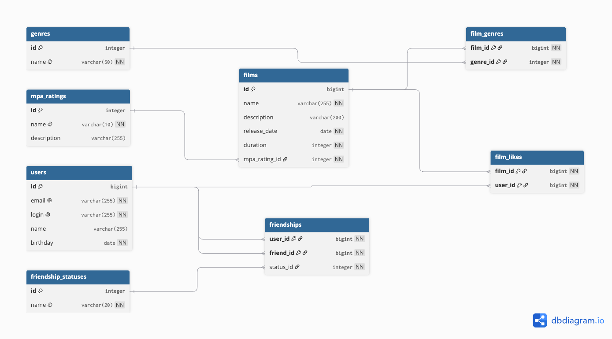
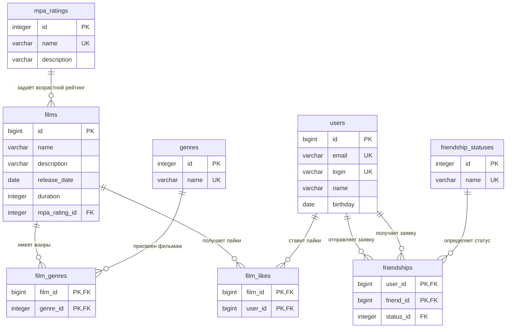

# java-filmorate

Сервис для работы с фильмами и пользовательскими оценками: пользователи добавляют фильмы,
ставят лайки, дружат между собой и получают список самых популярных фильмов.

## Схема базы данных



[Открыть схему в dbdiagram.io](https://dbdiagram.io/d/6a85df71fd15a881e5b9c19b)

<details>
<summary>Та же схема в виде mermaid-диаграммы</summary>



</details>

Исходник диаграммы в формате DBML лежит в [docs/filmorate.dbml](docs/filmorate.dbml) —
его можно вставить в [dbdiagram.io](https://dbdiagram.io/d) и получить ту же схему.

## Описание таблиц

### Основные сущности

**`users`** — пользователи сервиса.

| Поле | Тип | Описание |
|---|---|---|
| `id` | `bigint` | PK, автоинкремент |
| `email` | `varchar(255)` | `NOT NULL`, `UNIQUE` |
| `login` | `varchar(255)` | `NOT NULL`, `UNIQUE` |
| `name` | `varchar(255)` | может быть пустым — тогда приложение подставляет `login` |
| `birthday` | `date` | `NOT NULL` |

**`films`** — фильмы.

| Поле | Тип | Описание |
|---|---|---|
| `id` | `bigint` | PK, автоинкремент |
| `name` | `varchar(255)` | `NOT NULL` |
| `description` | `varchar(200)` | ограничение длины из ТЗ |
| `release_date` | `date` | `NOT NULL` |
| `duration` | `integer` | `NOT NULL`, `CHECK (duration > 0)`, минуты |
| `mpa_rating_id` | `integer` | FK → `mpa_ratings.id`, у фильма ровно один рейтинг |

Количество лайков в `films` не хранится: это производное значение, оно вычисляется по
`film_likes`. Отдельная колонка означала бы два источника правды и рассинхронизацию при
любом сбое между вставкой лайка и обновлением счётчика.

### Справочники

**`mpa_ratings`** — возрастные рейтинги MPA: `G`, `PG`, `PG-13`, `R`, `NC-17`.
Поле `description` хранит расшифровку («лицам до 17 лет только в присутствии взрослого»),
поэтому текст ограничений не приходится дублировать в коде.

**`genres`** — жанры: Комедия, Драма, Мультфильм, Триллер, Документальный, Боевик.

**`friendship_statuses`** — статусы дружбы: `UNCONFIRMED` (заявка отправлена, ответа нет)
и `CONFIRMED` (заявка принята).

У всех трёх справочников на `name` стоит `UNIQUE` — двух «Комедий» в базе не появится.

### Связующие таблицы

**`film_genres`** — жанры фильма, связь «многие ко многим». Первичный ключ составной
(`film_id`, `genre_id`), поэтому один жанр нельзя присвоить фильму дважды.

**`film_likes`** — лайки. Первичный ключ составной (`film_id`, `user_id`): один
пользователь ставит фильму не более одного лайка, повторный запрос упадёт на уровне базы,
а не на уровне проверки в сервисе.

**`friendships`** — дружеские связи. Связь направленная: `user_id` — тот, кто отправил
заявку, `friend_id` — получатель, `status_id` — текущий статус. Одна заявка = одна строка,
встречной записи при подтверждении не создаётся, меняется только статус.

Ограничения таблицы:

* `PRIMARY KEY (user_id, friend_id)` — повторные заявки от того же пользователя тому же
  невозможны;
* `CHECK (user_id <> friend_id)` — нельзя добавить в друзья самого себя.

Внешние ключи на `films` и `users` объявлены с `ON DELETE CASCADE`: при удалении фильма
или пользователя его лайки, жанровые связи и дружеские связи уходят вместе с ним. Ссылки
на справочники — `ON DELETE RESTRICT`, чтобы жанр или рейтинг нельзя было удалить, пока он
используется.

## Соответствие нормальным формам

* **1NF** — все столбцы атомарны. Жанры фильма вынесены в `film_genres`, а не в массив или
  строку с разделителями.
* **2NF** — таблицы с составным ключом (`film_genres`, `film_likes`) не содержат
  неключевых атрибутов вовсе, поэтому частичных зависимостей нет. В `friendships`
  единственный неключевой атрибут `status_id` зависит от пары целиком.
* **3NF** — названия жанров, рейтингов и статусов хранятся в справочниках, в основных
  таблицах лежат только `id`. Транзитивных зависимостей между неключевыми полями нет,
  вычисляемых полей (вроде счётчика лайков) в схеме тоже нет.

## Примеры запросов

### Все фильмы с возрастным рейтингом

```sql
SELECT f.id,
       f.name,
       f.description,
       f.release_date,
       f.duration,
       m.name AS mpa_rating
FROM films AS f
JOIN mpa_ratings AS m ON m.id = f.mpa_rating_id
ORDER BY f.id;
```

### Фильм по идентификатору вместе с жанрами

```sql
SELECT f.id,
       f.name,
       f.release_date,
       f.duration,
       m.name AS mpa_rating,
       g.name AS genre
FROM films AS f
JOIN mpa_ratings AS m ON m.id = f.mpa_rating_id
LEFT JOIN film_genres AS fg ON fg.film_id = f.id
LEFT JOIN genres AS g ON g.id = fg.genre_id
WHERE f.id = ?;
```

`LEFT JOIN` нужен, чтобы фильм без указанных жанров всё равно попал в результат.

### Топ N популярных фильмов

```sql
SELECT f.id,
       f.name,
       COUNT(fl.user_id) AS likes_count
FROM films AS f
LEFT JOIN film_likes AS fl ON fl.film_id = f.id
GROUP BY f.id, f.name
ORDER BY likes_count DESC, f.name
LIMIT ?;
```

Здесь тоже `LEFT JOIN`: фильмы без лайков должны присутствовать в выдаче, иначе на свежей
базе топ окажется пустым.

### Все пользователи

```sql
SELECT id, email, login, name, birthday
FROM users
ORDER BY id;
```

### Пользователь по идентификатору

```sql
SELECT id, email, login, name, birthday
FROM users
WHERE id = ?;
```

### Друзья пользователя

```sql
SELECT u.id, u.email, u.login, u.name, u.birthday
FROM friendships AS f
JOIN users AS u ON u.id = f.friend_id
WHERE f.user_id = ?;
```

### Только подтверждённые друзья

```sql
SELECT u.id, u.login, u.name
FROM friendships AS f
JOIN friendship_statuses AS s ON s.id = f.status_id
JOIN users AS u ON u.id = f.friend_id
WHERE f.user_id = ?
  AND s.name = 'CONFIRMED';
```

### Входящие заявки в друзья

```sql
SELECT u.id, u.login, u.name
FROM friendships AS f
JOIN friendship_statuses AS s ON s.id = f.status_id
JOIN users AS u ON u.id = f.user_id
WHERE f.friend_id = ?
  AND s.name = 'UNCONFIRMED';
```

Отдельная таблица для входящих заявок не нужна — это выборка из `friendships` по
получателю и статусу.

### Общие друзья двух пользователей

```sql
SELECT u.id, u.login, u.name
FROM users AS u
JOIN friendships AS f1 ON f1.friend_id = u.id AND f1.user_id = ?
JOIN friendships AS f2 ON f2.friend_id = u.id AND f2.user_id = ?;
```

Два `JOIN` к одной таблице оставляют только тех пользователей, которые есть в списках
друзей обоих — это и есть пересечение.

### Лайк фильму

```sql
INSERT INTO film_likes (film_id, user_id)
VALUES (?, ?);
```

```sql
DELETE FROM film_likes
WHERE film_id = ? AND user_id = ?;
```

### Заявка в друзья и её подтверждение

```sql
INSERT INTO friendships (user_id, friend_id, status_id)
VALUES (?, ?, (SELECT id FROM friendship_statuses WHERE name = 'UNCONFIRMED'));
```

```sql
UPDATE friendships
SET status_id = (SELECT id FROM friendship_statuses WHERE name = 'CONFIRMED')
WHERE user_id = ? AND friend_id = ?;
```

### Жанры фильма

```sql
SELECT g.id, g.name
FROM genres AS g
JOIN film_genres AS fg ON fg.genre_id = g.id
WHERE fg.film_id = ?
ORDER BY g.id;
```
